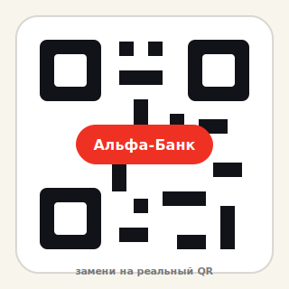

# POE2 Campaign Codex Overlay Landing

Статичный одностраничный сайт для beta-версии POE2 Campaign Codex Overlay.

## Что внутри

- `index.html` — разметка сайта
- `styles.css` — дизайн
- `script.js` — плавный scroll и переключение скриншотов
- `assets/` — папка под скриншоты и будущие картинки

## Что нужно заменить перед публикацией

1. В `index.html` блок `#download` уже ведёт на GitHub Releases:
   `https://github.com/UmbraMalik/poe2-campaign-codex-releases/releases`
   При смене репозитория релизов нужно заменить только эту ссылку.

2. В блоке `#support` заменить QR-заглушку на реальный QR Альфа-Банка.
   Подробная инструкция ниже.

3. В блоке `#support` заменить ссылки Telegram / Фидбек на реальные адреса, если они нужны.

4. В секции `#screens` лежат актуальные референсы: основной overlay, подробная панель и режим “только таймер”. При обновлении приложения достаточно заменить PNG-файлы в `assets/screens/`, не меняя разметку.

Пример:

```html
<div class="screenshot-placeholder">
  
</div>
```

И добавить CSS:

```css
.screenshot-placeholder img {
  width: 100%;
  height: 100%;
  object-fit: cover;
}
```

## Где бесплатно выложить

- GitHub Pages
- Cloudflare Pages
- Netlify
- Vercel

Сервер не нужен. Это обычный статичный сайт.

## QR для поддержки через Альфа-Банк

В блоке «Поддержать» сейчас стоит заглушка:

```html

```

Чтобы поставить настоящий QR:

1. Сохрани QR-код как `assets/support/alfa-qr.png`.
2. В `index.html` замени путь картинки на:

```html

```

Текст приписки для перевода уже добавлен: `Поддержка POE2 Campaign Codex`.


## Скриншот оверлея

В hero-блок сайта добавлен реальный скриншот приложения: `assets/screens/overlay-real-reference.png`.


Обновление: в секции скриншотов добавлены реальные референсы Companion Panel и режима «только таймер».
